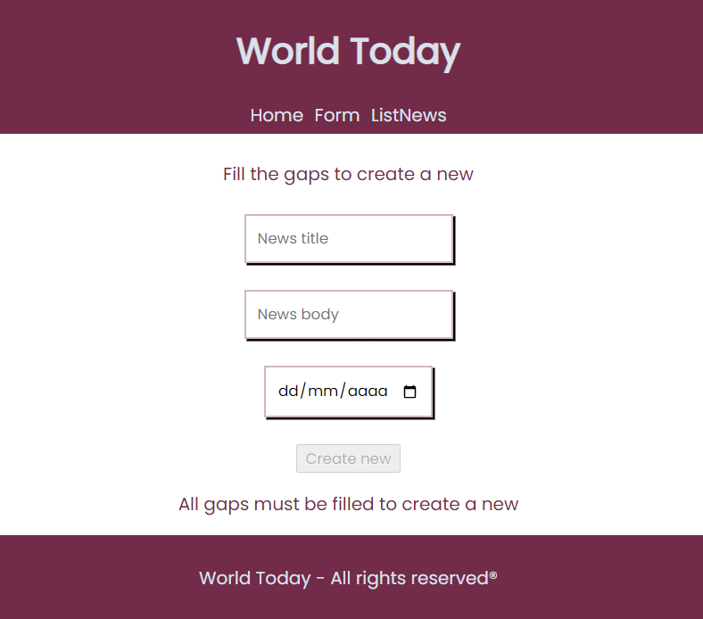
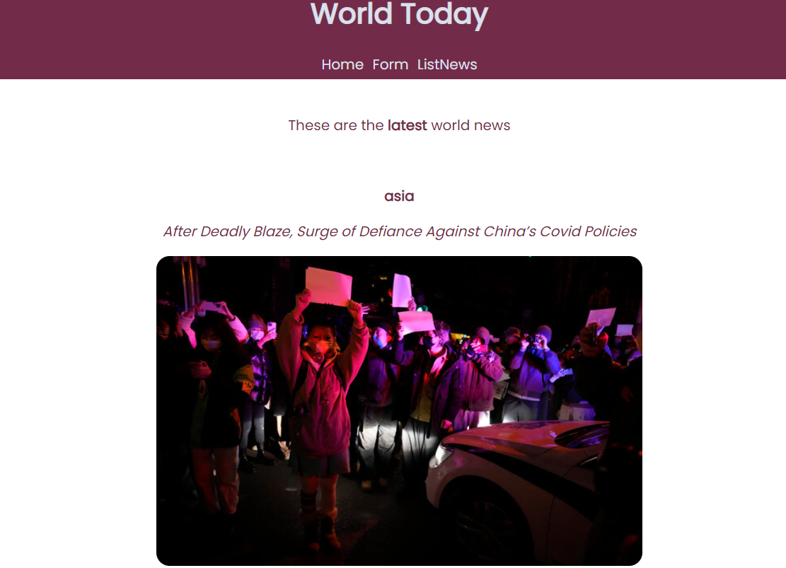

# 1st React Project - News Page

 <h3 align="center">MERN STACK FRONTEND PROJECT</h3>

  <p align="center">
    News Page made using Javascript and React with Context and SASS.
    <br />
    <a href="https://github.com/miguelherreravillanueva/React.Project-Newspage"><strong>Explore the docs »</strong></a>
    <br />
    ·
    <a href="https://github.com/miguelherreravillanueva/React.Project-Newspage/issues">Report Bug</a>
    ·
    <a href="https://github.com/miguelherreravillanueva/React.Project-Newspage/issues">Request Feature</a>
  </p>
</div>


<!-- TABLE OF CONTENTS -->
<details>
  <summary>Table of Contents</summary>
  <ol>
        <li><a href="#objectives">Objectives</a></li>
    <li>
      <a href="#about-the-project">About The Project</a>
      <ul>
        <li><a href="#endpoints">Endpoints</a></li>
         <li><a href="#built-with">Built With</a></li>
      </ul>   
    </li>
    <li>
      <a href="#getting-started">Getting Started</a>
      <ul>
        <li><a href="#prerequisites">Prerequisites</a></li>
        <li><a href="#installation">Installation</a></li>
      </ul>
    </li>
    <li><a href="#future-roadmap">Future Roadmap</a></li>
    <li><a href="#contributing">Contributing</a></li>
    <li><a href="#license">License</a></li>
    <li><a href="#acknowledgments">Acknowledgments</a></li>
    <li><a href="#contact">Contact</a></li>
  </ol>
</details>

<!-- ABOUT THE OBJECTIVES -->
## Objectives
### Made a News Page using the following:
<objectives>
  <ol>
    <li>News API.<a href="https://developer.nytimes.com/apis"></a></li>
    <li>Implement React & SASS.</a></li>
    <li>Create a view Home.</a></li>
    <li>Create a view Form: introduce the new.</a></li>
    <li>Create a view List: pain the API news.</a></li>
</ol>
</objectives>


<!-- ABOUT THE PROJECT -->
## About The Project

This project is a frontend of a news page using a cloud API, made whith the objective of working in a realistic project using React with Context and SASS to manage the databases of a cloud API and creating a front view of it.


### Views

<views>
 
  <ol>
    <li>Home</a></li>
    <li>Form</a></li>
    <li>LinkNews</a></li>
  </ol>
</views>

The LinkNews view use a Context request.


<p align="right">(<a href="#readme-top">back to top</a>)</p>


### Built With

* [![Node][Node.JS]][Node.JS-url]
* [![Mongo][MongoDB]][MongoDB-url]
* [![SASS][SASS]][SASS-url]


<p align="right">(<a href="#readme-top">back to top</a>)</p>


<!-- GETTING STARTED -->
## Getting Started

This is an example of how you may give instructions on setting up your project locally.
To get a local copy up and running follow these simple example steps.

### Prerequisites

This is an example of how to list things you need to use the software and how to install them.
* npm
  ```sh
  npm install react sass
  ```

### Installation

_Below is an example of how you can instruct your audience on installing and setting up your app.

1. Clone the repo
   ```sh
   git clone https://github.com/miguelherreravillanueva/React.Project-Newspage.git
   ```
3. Install NPM packages
   ```sh
   npm install react sass
   ```
4. Ready to start!
  ```sh
  npm start
  ```


<p align="right">(<a href="#readme-top">back to top</a>)</p>


<!-- FUTURE -->
## Future Roadmap

- [ ] Add Swagger Documentation

<p align="right">(<a href="#readme-top">back to top</a>)</p>


<!-- CONTRIBUTING -->
## Contributing

Contributions are what make the open source community such an amazing place to learn, inspire, and create. Any contributions you make are **greatly appreciated**.

If you have a suggestion that would make this better, please fork the repo and create a pull request. You can also simply open an issue with the tag "enhancement".
Don't forget to give the project a star! Thanks again!

1. Fork the Project
2. Create your Feature Branch (`git checkout -b feature/YourName`)
3. Commit your Changes (`git commit -m 'Add some YourName'`)
4. Push to the Branch (`git push origin feature/YourName`)
5. Open a Pull Request

<p align="right">(<a href="#readme-top">back to top</a>)</p>


<!-- LICENSE -->
## License

This project is under license of Miguel Herrera

<p align="right">(<a href="#readme-top">back to top</a>)</p>


<!-- ACKNOWLEDGMENTS -->
## Acknowledgments

This space is made to list my favourites SOCIAL NETWORK projects that I have explored and inspired by while doing my app.

* https://github.com/radikalex/backend-social-network
* https://github.com/DanielMiguelez/React-individual-project
* https://github.com/msalvatore82/React-ApiNew 


<p align="right">(<a href="#readme-top">back to top</a>)</p>


<!-- PREVIEW -->
## Preview 

- Form general overview




- ListNew general overview




<!-- CONTACT -->
## Contact 
  <p align="center">
<a href = "mailto:mirkouda@gmail.com"></a>
    <a href="https://www.linkedin.com/in/mherrevi/" target="_blank"></a> 
</p>

<p align="right">(<a href="#readme-top">back to top</a>)</p>

---

Developed by [Miguel Herrera](https://github.com/miguelherreravillanueva)


<!-- MARKDOWN LINKS & IMAGES -->
<!-- https://www.markdownguide.org/basic-syntax/#reference-style-links -->

[linkedin-shield]: https://img.shields.io/badge/-LinkedIn-black.svg?style=for-the-badge&logo=linkedin&colorB=555
[linkedin-url]: https://linkedin.com/in/sergiocano-dev
[product-screenshot]: images/screenshot.png
[Next.js]: https://img.shields.io/badge/next.js-000000?style=for-the-badge&logo=nextdotjs&logoColor=white
[Next-url]: https://nextjs.org/
[React.js]: https://img.shields.io/badge/React-20232A?style=for-the-badge&logo=react&logoColor=61DAFB
[React-url]: https://reactjs.org/
[Vue.js]: https://img.shields.io/badge/Vue.js-35495E?style=for-the-badge&logo=vuedotjs&logoColor=4FC08D
[Vue-url]: https://vuejs.org/
[Angular.io]: https://img.shields.io/badge/Angular-DD0031?style=for-the-badge&logo=angular&logoColor=white
[Angular-url]: https://angular.io/
[JWT]: https://img.shields.io/badge/JWT-black?style=for-the-badge&logo=JSON%20web%20tokens
[JWT-url]: https://jwt.io/
[Vercel]: https://img.shields.io/badge/vercel-%23000000.svg?style=for-the-badge&logo=vercel&logoColor=white
[Vercel-url]: https://vercel.com/
[MongoDB]: https://img.shields.io/badge/MongoDB-%234ea94b.svg?style=for-the-badge&logo=mongodb&logoColor=white
[MongoDB-url]: https://www.mongodb.com/es
[Express.js]: https://img.shields.io/badge/express.js-%23404d59.svg?style=for-the-badge&logo=express&logoColor=%2361DAFB
[Express.js-url]: https://expressjs.com/
[Node.JS]: https://img.shields.io/badge/node.js-6DA55F?style=for-the-badge&logo=node.js&logoColor=white
[Node.JS-url]: https://nextjs.org/
[SASS]: https://img.shields.io/badge/SASS-pink?style=for-the-badge&logo=SASS&logoColor=white
[SASS-url]: https://sass-lang.com/

[Postman]: https://img.shields.io/badge/Postman-FF6C37?style=for-the-badge&logo=postman&logoColor=white
[Postman-url]: https://www.postman.com/

